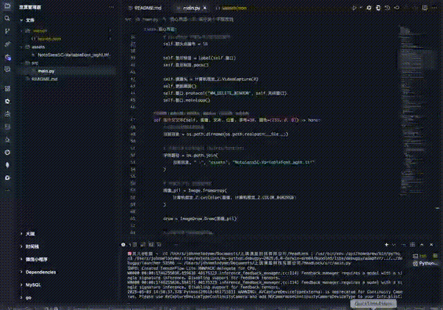

# 狙心

## 项目简介

**狙心**是一款基于 Python 的实时人脸追踪与心率估算工具，融合 Mediapipe、OpenCV、Tkinter 等前沿技术，能够通过摄像头捕捉你的头部运动并动态估算心率。无论是健康监测、交互娱乐还是科研实验，都能带来温柔又智能的陪伴体验。



> 上图为实际运行效果，快来体验科技与温暖的结合吧～

## 主要功能

- **实时人脸检测与追踪**：自动锁定你的脸蛋，精准追踪额头关键点。
- **头部运动分析**：根据头部动作动态调整心率估算，模拟真实生理反应。
- **心率动画可视化**：右下角心电图动画实时跳动，还有可爱的爱心陪伴你。
- **十字准星与瞄准线**：画面中绘制十字准星，精准显示头部位置，适合交互和游戏化场景。
- **中文界面与字体支持**：全中文界面，支持自定义中文字体，体验更亲切。

## 法律合规与免责声明

本工具仅供学习、科研及合法授权场景下使用。请严格遵守相关法律法规，尊重个人隐私与数据安全。开发者对任何非法使用或滥用本工具造成的后果概不负责。

- 遵循《中华人民共和国网络安全法》《电子数据取证规范》等相关法律法规。
- 禁止在未获授权的情况下采集、分析他人数据。
- 使用本工具即视为同意并承诺合法合规操作。

## 系统要求

- **操作系统**：Windows 7 64位及以上 / macOS 10.14 及以上 / Linux (Ubuntu 18.04 LTS 及以上)
- **硬件要求**：
  - CPU：双核及以上
  - 内存：4GB 及以上
  - 摄像头：支持 USB 摄像头
- **依赖环境**：
  - Python 3.8 及以上
  - OpenCV (`opencv-python`)
  - Mediapipe
  - Tkinter
  - Pillow
  - Numpy

## 安装方法

1. **克隆项目**
   ```bash
   git clone https://your.repo.url/HeadLock.git
   cd HeadLock
   ```

2. **安装依赖**

   ```bash
   pip3 install opencv-python mediapipe pillow numpy
   ```

   > Tkinter 通常随 Python 自带，如未安装请根据系统补装。

3. **字体资源**
   - 确保 `assets/NotoSansSC-VariableFont_wght.ttf` 字体文件存在，否则请自行下载并放入 `assets` 目录。

## 使用说明

1. **运行主程序**

   ```bash
   python3 src/main.py
   ```

2. **界面说明**
   - 启动后自动打开摄像头，检测到人脸后会在画面上显示十字准星、头部坐标、心率动画等信息。
   - 头部移动越大，心率估算值越高，心电图动画也会更活跃。
   - 关闭窗口即可退出程序。

## 目录结构

```
HeadLock/
├── assets/
│   └── NotoSansSC-VariableFont_wght.ttf
├── src/
│   └── main.py
└── README.md
```

## 常见问题

- **无法打开摄像头？**
  - 检查摄像头驱动和权限，确保未被其他程序占用。
- **中文字体不显示？**
  - 检查 `assets` 目录下字体文件是否存在，路径是否正确。
- **依赖安装失败？**
  - 建议使用 Python 3.8+，并确保 pip 已升级到最新版。

## 免责声明

本项目仅供技术交流与学习研究，严禁用于任何非法用途。使用本工具即表示同意遵守相关法律法规，开发者不承担任何因使用本工具产生的法律责任。

---

温馨提示：保持善意，尊重隐私，科技向善，狙心与你一起守护每一份真诚与安全！

---

如果你还想要更详细的功能介绍、法律条款引用或者使用演示图片等内容，也可以随时告诉我哦～希望这个 README 能让你的项目看起来又专业又有爱心！
>当前模型请求量过大，请求排队约 1 位，请稍候或切换至其他模型问答体验更流畅。


## 🌟 开源项目赞助计划

### 用捐赠助力发展

感谢您使用本项目！您的支持是开源持续发展的核心动力。  
每一份捐赠都将直接用于：  
✅ 服务器与基础设施维护（魔法城堡的维修费哟~）  
✅ 新功能开发与版本迭代（魔法技能树要升级哒~）  
✅ 文档优化与社区建设（魔法图书馆要扩建呀~）

点滴支持皆能汇聚成海，让我们共同打造更强大的开源工具！  
（小仙子们在向你比心哟~）

---

### 🌐 全球捐赠通道

#### 国内用户

<div align="center" style="margin: 40px 0">

<div align="center">
<table>
<tr>
<td align="center" width="300">

<br />
<strong>🔵 支付宝</strong>（小企鹅在收金币哟~）
</td>
<td align="center" width="300">

<br />
<strong>🟢 微信支付</strong>（小绿龙在收金币哟~）
</td>
</tr>
</table>
</div>
</div>

#### 国际用户

<div align="center" style="margin: 40px 0">
  <a href="https://qr.alipay.com/fkx19369scgxdrkv8mxso92" target="_blank">
    
  </a>
  
  <a href="https://ko-fi.com/F1F5VCZJU" target="_blank">
    
  </a>
  
  <a href="https://www.paypal.com/paypalme/ctkqiang" target="_blank">
    
  </a>
  
  <a href="https://donate.stripe.com/00gg2nefu6TK1LqeUY" target="_blank">
    
  </a>
</div>

---

### 📌 开发者社交图谱

#### 技术交流

<div align="center" style="margin: 20px 0">
  <a href="https://github.com/ctkqiang" target="_blank">
    
  </a>
  
  <a href="https://stackoverflow.com/users/10758321/%e9%92%9f%e6%99%ba%e5%bc%ba" target="_blank">
    
  </a>
  
  <a href="https://www.linkedin.com/in/ctkqiang/" target="_blank">
    
  </a>
</div>

#### 社交互动

<div align="center" style="margin: 20px 0">
  <a href="https://www.instagram.com/ctkqiang" target="_blank">
    
  </a>
  
  <a href="https://twitch.tv/ctkqiang" target="_blank">
    
  </a>
  
  <a href="https://github.com/ctkqiang/ctkqiang/blob/main/assets/IMG_9245.JPG?raw=true" target="_blank">
    
  </a>
</div>
